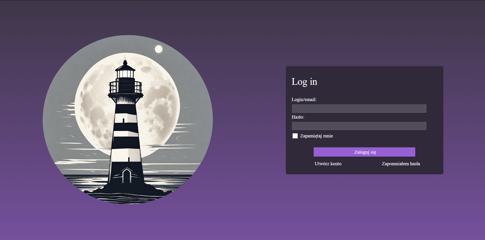
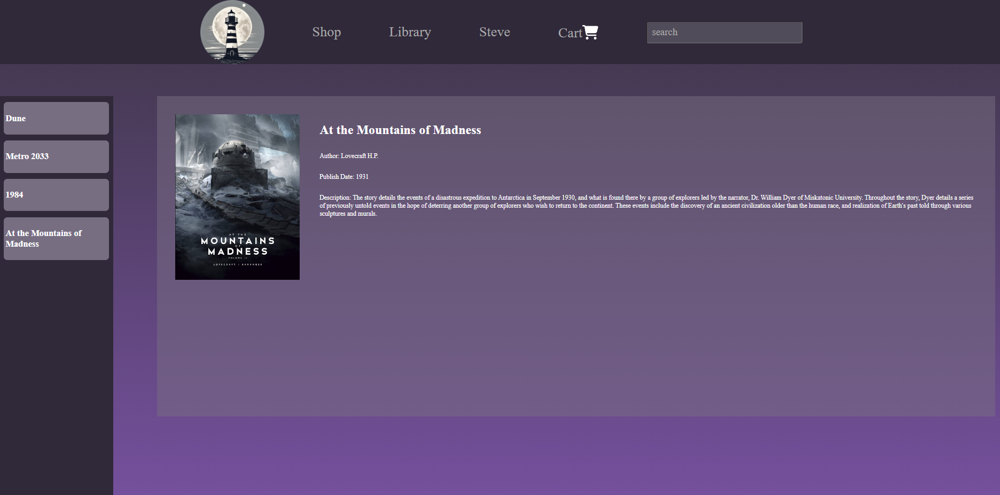
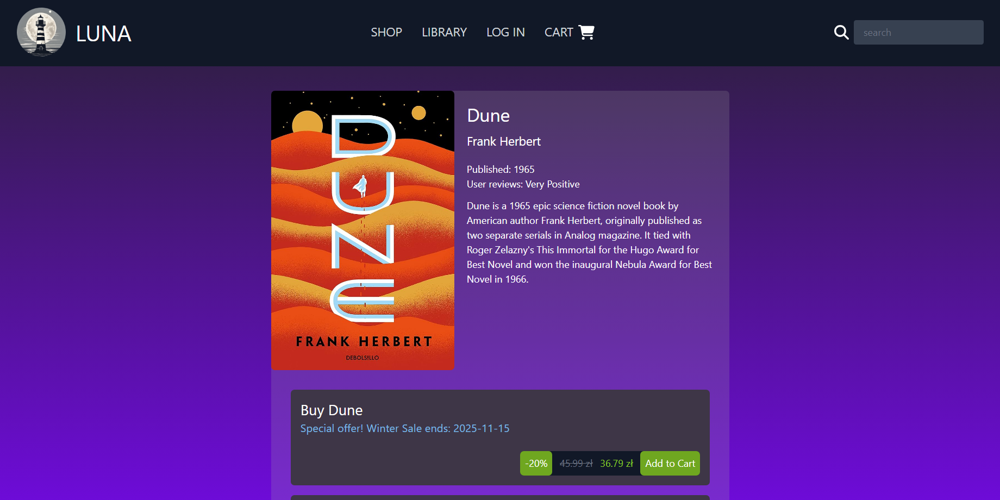
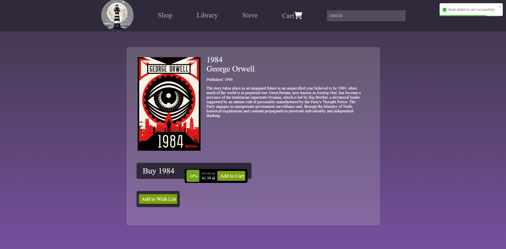
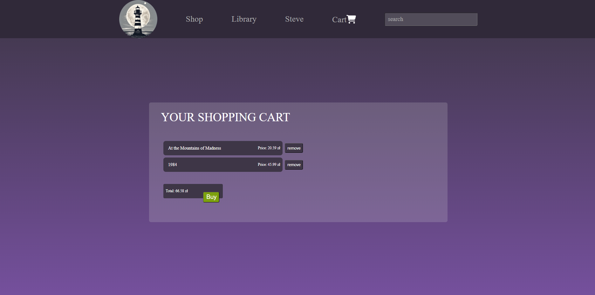

# Luna
projekt internetowej platformy do sprzedaży i dystrybucji ebooków

# Pages
* Main Page

* Login page

* Register page

* Books owned by user Steve at his Library

* Page of Book Steve would like to buy

* notification of book added to cart

* his cart

# Technologies

* ORM - Hibernate  
used for Object-Relational Mapping in project
* Java Spring Security  
for Authentication and Authorization in project, managing secure API calls using JWT token