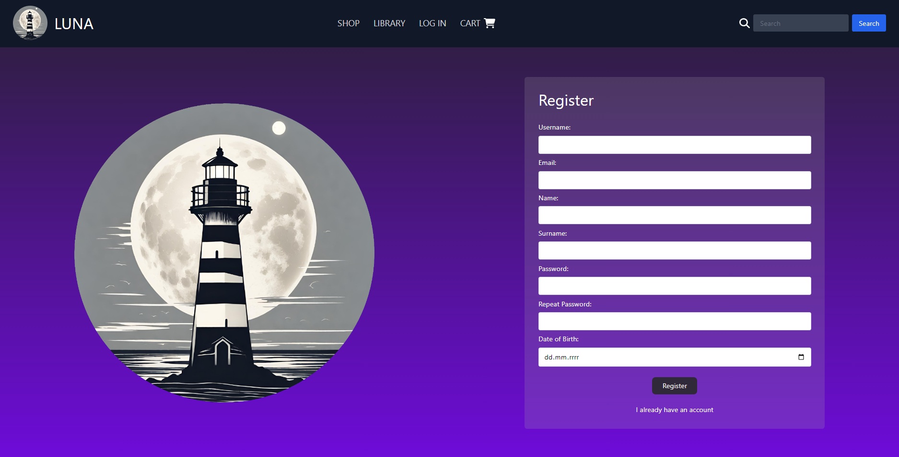

# Luna
Project of an online platform for the sale and distribution of e-books

# App functionalities
* Main Page

* Login page

* Register page

* confirmation of user creation, user is inactive until he confirms his email by sent link

* To confirm account email we sent an email, SMT server is simulated in developer environment using Maildev tool
* https://github.com/maildev/maildev

* Main page for logged user

* Dune page in shop

* search bar in top bar

* user can directly click book page showed in search results or enter just keyworld leading him into advanced search page
* advanced search page for typed h, results respond to filtering without need for page reloading  

* notification using react toastify after adding book to cart, many notifications like this are used to inform user about actions

# Purchases - PayU
* User cart after adding a couple of books

* buy leads user to external payment operator PayU

* Mike chooses payment option

* after payment PayU navigates user back to our app where user can check his order
  
* books are added to his personal library where he can download them at any time
  
* his cart is cleared after purchase
  
* We can track payments and their status at sandbox provided by PayU, nearly identical system to PayU payment system
  
* We can see that payment by Mike has been finished successfully 

# Password recovery
* User can type his email in case of forgetting password
* An otp is generated lasting 5 min for password recover, an email is sent to user
  
* typing new password
* 
* success
  
  
# Frontend
using vite, react, typescript and tailwind on separate repository
https://github.com/KaVerSv/Luna-frontend

# Database
PostgreSQL database in docker container

Diagram of database

# Technologies
* Docker: Utilized for hosting the PostgreSQL database, ensuring scalability and streamlined containerized deployment.
* Hibernate: Implemented as the Object-Relational Mapping (ORM) tool to facilitate seamless interaction between the Java application and the database.
* Java Spring Security: Employed for authentication and authorization within the project, securing API calls through the use of JWT tokens.